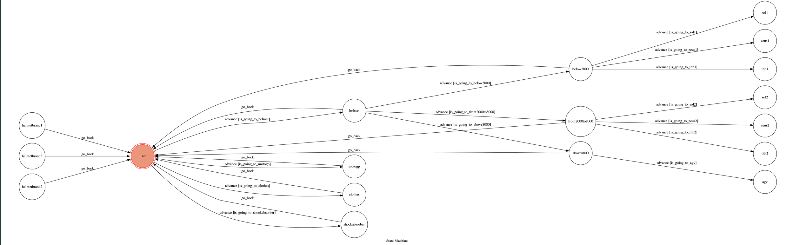

# TOC Project 2017

Template Code for TOC Project 2017

A telegram bot based on a finite state machine

## Setup

### Prerequisite
* Python 3

#### Install Dependency
```sh
pip install -r requirements.txt
```

* pygraphviz (For visualizing Finite State Machine)
    * [Setup pygraphviz on Ubuntu](http://www.jianshu.com/p/a3da7ecc5303)

### Secret Data

`API_TOKEN` and `WEBHOOK_URL` in app.py **MUST** be set to proper values.
Otherwise, you might not be able to run your code.

### Run Locally
You can either setup https server or using `ngrok` as a proxy.

**`ngrok` would be used in the following instruction**

```sh
ngrok http 5000
```

After that, `ngrok` would generate a https URL.

You should set `WEBHOOK_URL` (in app.py) to `your-https-URL/hook`.

#### Run the sever

```sh
python3 app.py
```

## Finite State Machine


## Usage
The initial state is set to `user`.

Every time `user` state is triggered to `advance` to another state, it will `go_back` to `user` state after the bot replies corresponding message.

* user
	* Input: "go to state1"
		* Reply: "I'm entering state1"

	* Input: "go to state2"
		* Reply: "I'm entering state2"


## Author
[Lee-W](https://github.com/Lee-W)


## README MY CODE
程式一開始為USER ，我的states有這些 :'user',
        'helmet',
        'motogp',
        'clothes',
        'shockabsorber',
        'below2000',
        'from2000to8000',
        'above8000',
        'sol1',
        'sol2',
        'zeus1',
        'zeus2',
        'thh1',
        'thh2',
        'agv'
 
 我預計是要做一套諮詢系統，讓喜歡機車的人可以有一套對話系統來了解自己相要的資訊，原本共有"安全帽"、"motogp"、"車衣"、"避震器"等4項
 但因時間不夠所以只做了第一項，但後續的原理是大同小異的
 
 首先一開始我們輸入helmet，代表想要了解有關安全帽的資訊，系統判斷使用者正在輸入文字後判定當為helmet時，進入state "helmet"，此時會問使用者的預算，區分為"2000以下"、"2000~8000"、"8000以上"，每個區段又是一個state，其中會請使用者選出想要的品牌，而不同的品牌可能有不一樣的state，像sol、zeus、thh有2000以下和2000~8000的帽款，所以會有兩種state，這兩種state分別的source不一樣，一個為"below2000"另一個則為"from2000to8000"，此目的為用以判斷當使用者在選擇不同價格區間後，選擇同一個品牌會有不同的安全帽出現，這部分有個bonus是傳送圖片給使用者看到安全帽的圖案。而agv因為價格較高，故只有落在8000子上這個區間，所以只需一種state。
 後續的motogp、車衣、避震器則是用類似的概念來完成，但沒有實做出來
